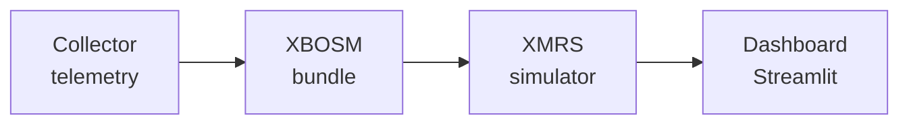

# XMRS + XBOSM

**XRPL propagation optimization** — a small pipeline for collecting network-facing signals, summarizing them into an **XBoSM** (cross-boundary operational state model) bundle, stress-testing scenarios with **XMRS** (XRPL message relay simulation), and visualizing results in a **Streamlit** dashboard.

Built as a hackathon-friendly scaffold: clear stages, JSON/JSONL artifacts, and a CLI that strings everything together.

---

## Architecture

Data flows in one direction; each stage writes artifacts the next can consume.




| Stage | Role |
|--------|------|
| **Collector** | Ingests or normalizes telemetry (including WebSocket-fed sources) into append-only **JSONL** events. |
| **XBOSM** | Aggregates collected events into a structured **bundle JSON** — a compact view of propagation-relevant state for analysis and demos. |
| **XMRS** | Runs a lightweight **simulator** that emits synthetic ticks / load scenarios to exercise the pipeline without a full network lab. |
| **Dashboard** | **Streamlit** app for charts and tables over bundles, logs, and simulation output (pandas / matplotlib). |

---

## Setup

**Requirements:** Python 3.10+

```bash
cd xmrs-xbosm
python -m venv .venv
source .venv/bin/activate # Windows: .venv\Scripts\activate
pip install -U pip
pip install -r requirements.txt
pip install -e .
```

Copy example configs if you want editable paths under `configs/`:

```bash
cp configs/collector.example.yaml configs/collector.yaml
cp configs/xbosm.example.yaml configs/xbosm.yaml
cp configs/xmrs.example.yaml configs/xmrs.yaml
```

---

## Demo (CLI pipeline)

Run the three stages in order using the example configs (or your copies under `configs/`):

```bash
# 1) Collect → data/processed/collected_events.jsonl
python -m xmrs_xbosm collect --config configs/collector.example.yaml

# 2) Generate XBoSM bundle → outputs/reports/xbosm_bundle.json
python -m xmrs_xbosm generate-xbosm --config configs/xbosm.example.yaml

# 3) XMRS simulator → data/processed/xmrs_simulated.jsonl
python -m xmrs_xbosm simulate-xmrs --config configs/xmrs.example.yaml
```

**Smoke-test the install** (dev dependencies from `pyproject.toml`):

```bash
pip install -e ".[dev]"
pytest
```

**Dashboard:** add or point Streamlit at your app module, then:

```bash
streamlit run path/to/your_dashboard.py
```

Use pandas to load `outputs/reports/xbosm_bundle.json` or JSONL outputs under `data/processed/` for quick plots.

---

## Repository layout (high level)

| Path | Purpose |
|------|---------|
| `src/xmrs_xbosm/` | Package: collector, XBoSM generator, XMRS simulator, shared models |
| `configs/*.example.yaml` | Example configuration for each stage |
| `data/processed/` | JSONL outputs (gitignored except `.gitkeep`) |
| `outputs/reports/` | Generated bundle JSON |

---

## License

See [LICENSE](LICENSE) if present in the repo root.
